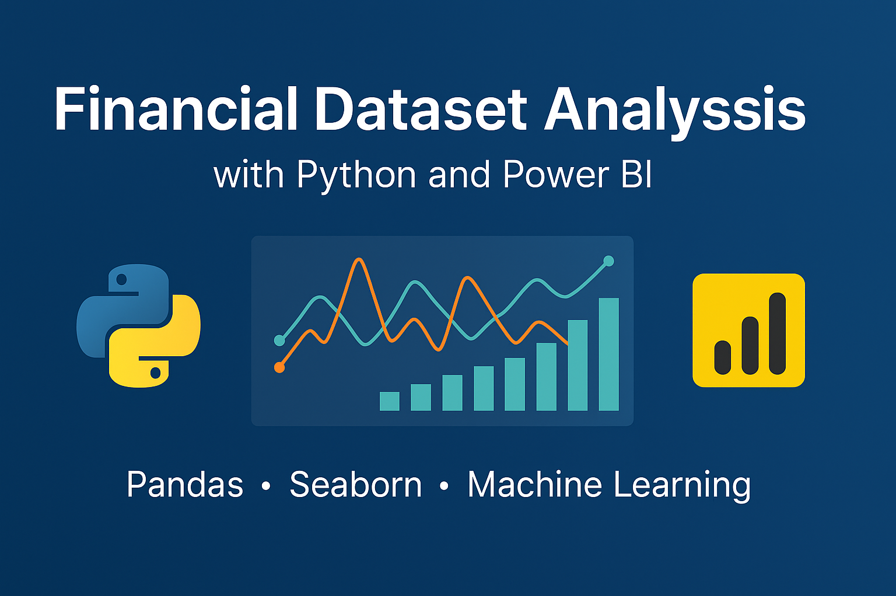

# 📊 Financial Dataset Analysis with Python and Power BI

A comprehensive data analysis project using Python to clean, explore, visualize, and model a real-world financial dataset.

---

## 📌 Project Description (English)

This project analyzes a financial dataset containing department-level monthly budgets, spending, and revenues. The goal is to:
- Clean and preprocess raw financial data
- Analyze spending and profits across departments
- Create insightful visualizations using Seaborn and Matplotlib
- Build a predictive model to estimate monthly profit/loss
- Provide business insights to support strategic decisions

---

## 📌 وصف المشروع (عربي)

يهدف هذا المشروع إلى تحليل بيانات مالية حقيقية تتضمن الميزانية الشهرية والمصروفات والإيرادات لكل قسم داخل الشركة، ويشمل:
- تنظيف ومعالجة البيانات الخام
- تحليل الإنفاق والربح حسب الأقسام
- إنشاء رسوم بيانية توضيحية باستخدام Seaborn وMatplotlib
- بناء نموذج تنبؤي لتقدير الربح/الخسارة
- تقديم رؤى لدعم اتخاذ القرار

---

## 🧪 Tools & Libraries / الأدوات والمكتبات

- Python (Pandas, NumPy, Seaborn, Matplotlib)
- Power BI (for advanced dashboard visualization)
- Machine Learning (Linear Regression)

---

## 📈 Key Visuals

| Profit Trends | Total Spending |
|---------------|----------------|
|  |  |

---

## 🚀 How to Use

1. Clone this repo
2. Install required libraries:
3. Open `analysis_financial_dataset.ipynb` and run step-by-step

---

## 📊 Result Highlights

- Marketing department had the highest total spending
- HR achieved the highest total profit
- July was the month with the biggest loss across departments

---

## 🧠 Author

**Mohammed T.** — Python Developer | Data Analyst | Power BI Specialist  
🔗 [Upwork Profile](https://www.upwork.com/freelancers/~012...)  
📫 Reach me for freelance data analytics and automation projects!

